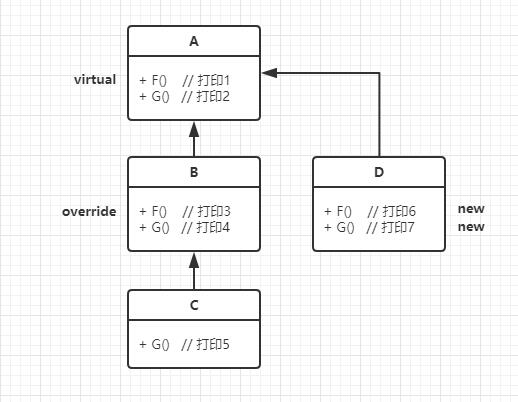
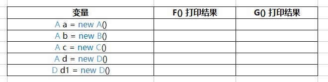
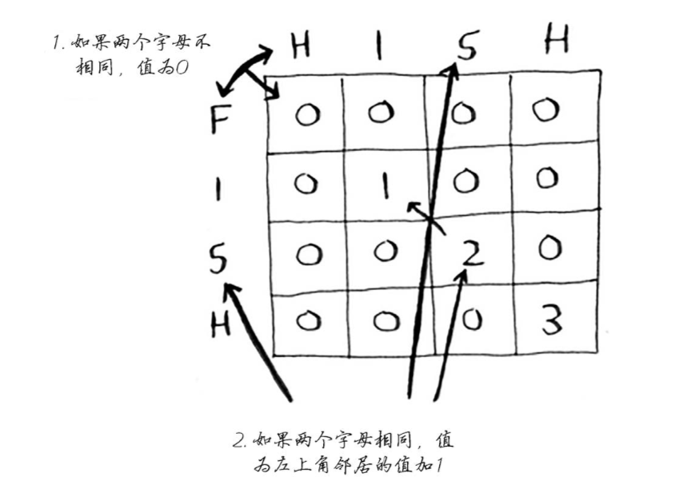

### 1. C# 可空类型

```c#
int? num1 = null;
```


### 2. C# 自动实现属性

```c#
public int Value { set; get;}
```

这就叫“自动实现属性”

第一，不能再提供方法体；第二，可以用来限制“只读不写”


### 3. FlagsAttribute 属性

常与**枚举**配合使用

官方文档：https://docs.microsoft.com/en-us/dotnet/api/system.flagsattribute?redirectedfrom=MSDN&view=netframework-4.7.2


### 4. 拖拽

```c#
void IDragHandler.OnDrag(PointerEventData eventData)
 {
RectTransformUtility.ScreenPointToWorldPointInRectangle(this.GetComponent<RectTransform>(), Input.mousePosition, Camera.main, out newPosition);

        //transform.position = newPosition + GameHelper.ChipOnDragPosOffset;
        //transform.localScale = GameHelper.ChipOnDragScale;
}
```


### 5. 算法：打印二叉树层级平均数

```c#
public IList<double> AverageOfLevels(TreeNode root)
{
        List<double> res = new List<double>();
        if (root == null) return res;

        Queue<TreeNode> queue = new Queue<TreeNode>();
        queue.Enqueue(root);

        while (queue.Count > 0)
        {
            int count = queue.Count;
            int num = 0;
            double sum = 0;

            while (count > 0)
            {
                TreeNode node = queue.Dequeue();
                count--;

                sum += root.val; num++;

                if(node.left != null) queue.Enqueue(node.left);
                if(node.right != null) queue.Enqueue(node.right);

            }

            double d = sum / num;
            res.Add(d);
        }

        return res;

}
```

有两点需要注意：

第一，除了层级遍历之外，还需要把**每一层划分清楚**

第二，用来求和的 `sum` 需要申明为 `double` , 否则会出现**溢出**错误


### 6. C# 无符号右移

在C#中没有，所以，需要**先转成无符号数再右移**

```c#
int num = -12;
num = (int)((uint)num >> 1);
```

其他情况，一律视为**除以2的高效率形式**

比如，`  int num = -12; num = num >> 1; ` 此时，` num ` 等于 -6


### 7. 算法：统计1到N出现“1”的个数

直接说结论吧：

比如：N = 36271。

从低位到高位遍历一遍，比如，遍历到百位2，那么，我们把前面的36定义为 `highNumber` ，百位权值100定义为 `weight` ，后面的71定义为 `lowNumber` ，当前值2定义为 `curNumber` 

所以，逻辑就是：

- 如果 curNumber > 1，那么，当前和为 `( highNumber + 1 ) * weight`
- 如果 curNumber == 1，那么，当前和为 ` hightNumber * weight + lowNumber + 1 `

- 如果 curNumber == 0，那么，当前和为 ` highNumber * weight `

所以，从低位到高位遍历一遍，把所有 当前和 加起来即可

```c#
private int GetOneSum(int number)
{
    int res = 0;

    int weight = 1;
    int lowNumber = 0;
    int highNumber = 0;
    int curNumber = 0;

    while(number % weight != 0)
    {
        lowNumber = number - (number / weight) * weight;
        highNumber = number / (weight * 10);
        curNumber = (number / weight) % 10;

        int sum = 0;
        if (curNumber > 1)
        sum = (highNumber + 1) * weight;
        else if (curNumber == 1)
        sum = highNumber * weight + lowNumber + 1;
        else
        sum = highNumber * weight;

        res += sum;
        weight *= 10;
    }

    return res;
}
```


### 8.  virtual、override和new



上述代码关系中，如下打印结果是什么？



三点：

- 总的逻辑是：先看**声明类**，再看**实例类**；如果是非虚，直接执行；如果是override，直接执行；其他情况，一直往父类找，找到override或者声明类为止
- 上述，比如 `B` 中的 `G()` ，虽然没有写 new，但**不写则是默认为new**
- 答案是：1, 3, 3, 1, 6; 2, 2, 2, 2, 7


### 9. 算法：[动态规划]最长公共子串长度

题目很简单：比如，hish 和 fish, 最长公共子串是 ish, 所以长度为3



三点：

- 第一行和第一列 **初始化为0**
- 状态方程如图所示：**不同则为0，相同则左上角加1**
- 最大值不一定在最后一格，需要用比较值max

```c#
public int LCS(string s1, string s2)
{
    int len1 = s1.Length;
    int len2 = s2.Length;
    int result = 0;

    int[,] dp = new int[len1 + 1, len2 + 1];

    for (int i = 0; i <= len1; i++) 
    {  
        for(int j = 0; j <= len2; j++) 
        {  
            if(i == 0 || j == 0) 
            {  
                dp[i,j] = 0;  
            } else if (s1[i] == s2[j]) 
            {  
                dp[i,j] = dp[i - 1, j - 1] + 1;  
                result = Math.Max(dp[i, j], result);  
            } else 
            {  
                dp[i,j] = 0;  
            }  
        }  
    }  
    return result;  
}  
```


### 10. 静态构造函数

```c#
public class Student
{
    static Student()
    { ... }
}
```

特点是：

- **static + 类名**，不能有访问修饰符、不能带参数
- 只能有一个 静态构造函数
- 静态构造函数 和 非静态构造函数 可以共存

作用：

- 初始化 静态字段（静态字段当然属于**类级别的项**）

调用：

- 在引用任何静态成员之前、在创建类的实例之前
- 系统自动调用


### 11. *ContainsKey* 和 *TryGetValue*

结论就是：**推荐使用TryGetValue**

更高效，时间复杂度是O(1)

比如，有一个经典的用法，计数（有则加1，没有则从1开始）

```c#
var value = 120;
if (dictionary.TryGetValue(key, out value))
{
	dictionary[key] = ++value;
}
else
{
	dictionary.Add(key, 1);
}
```

需要注意的是，如果key不存在，则返回false，那么value值会变成初始值（即使前面赋成了120，这里初始值的意思是，引用类型为null，值类型为0）


### 12. 趣题：输入自身的代码

```c#
// 这些代码必须写成一行
class writeme{static void Main(){string s="class writeme{{static void Main(){{string s={0}{1}{0};System.Console.Write(s,(char)34,s);}}}}"; System.Console.Write(s,(char)34,s);}}
```


### 13. 题外传送门

1. Entitas框架 https://github.com/sschmid/Entitas-CSharp
2. 3Blue1Brown 线性代数视频 <http://www.bilibili.com/video/av6731067/#page=1>
3. 插件InkPainter https://github.com/EsProgram/InkPainter
4. SetProperty https://github.com/LMNRY/SetProperty
